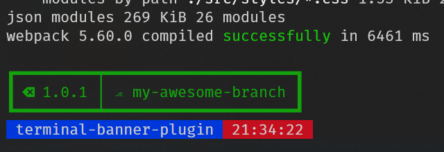

# Webpack Terminal Banner Plugin
Webpack plugin for showing banner after all notifications

[](https://www.npmjs.com/package/@inoy/terminal-banner-plugin)
[](https://github.com/inoyakaigor/TerminalBannerPlugin/actions/workflows/npm-publish.yml)



## Using
```js
// webpack.config.js
const TerminalBannerPlugin = require('@inoy/terminal-banner-plugin')
// other code

module.exports = {
    //… rest of your webpack config
    plugins: [
        new WebpackNotifier2Plugin(/* check out my other plugin ;-) */),
        new TerminalBannerPlugin({
            emptyLineBefore: false, // optional; put empty line before the banner
            emptyLineAfter: false // optional; put empty line after the banner
        })
    ]
}
```
Also you can use couple of functions `getTag` and `getBranch` separately

```js
const terminalBannerPlugin = new TerminalBannerPlugin()

const currentTag = terminalBannerPlugin.getTag() ?? 'unknown tag'
const currentBranch = terminalBannerPlugin.getBranch() ?? 'unknown branch'
```

The banner will show only in development mode

## Requirements
Minimal supported Node version is 20.19.

## License
GPLv3
